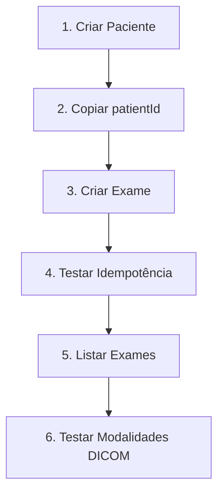

# 🏥 Medical Patients API - Backend

Sistema de cadastro de pacientes e exames médicos com modalidades DICOM desenvolvido com **NestJS**, **TypeScript** e **PostgreSQL**.

## 📋 Índice

- [Visão Geral](#-visão-geral)
- [Tecnologias Utilizadas](#-tecnologias-utilizadas)
- [Arquitetura](#-arquitetura)
- [Recursos Implementados](#-recursos-implementados)
- [Instalação e Configuração](#-instalação-e-configuração)
- [Testes de Integração](#-testes-de-integração)
- [Testes com Postman](#-testes-com-postman)
- [Documentação da API](#-documentação-da-api)
- [Validações e Segurança](#-validações-e-segurança)
- [Estrutura do Projeto](#-estrutura-do-projeto)
- [Endpoints da API](#-endpoints-da-api)

## 🎯 Visão Geral

Este backend foi desenvolvido para atender aos requisitos de um sistema médico que permite:

- **Cadastro de pacientes** com validação de CPF único
- **Gestão de exames médicos** com modalidades DICOM
- **Idempotência** para evitar duplicação de exames
- **Paginação** em todas as consultas
- **Transações ACID** para consistência de dados
- **Validações robustas** em todas as camadas

### ✅ Critérios de Aceite Atendidos

| Critério | Status | Implementação |
|----------|---------|---------------|
| ✅ Endpoints REST para pacientes e exames | **Completo** | Controllers com validação |
| ✅ Idempotência no cadastro de exames | **Completo** | Chave única + transações |
| ✅ Estrutura segura para requisições concorrentes | **Completo** | Transações com QueryRunner |
| ✅ Paginação para consultas | **Completo** | DTO de paginação customizado |
| ✅ Validação de campos obrigatórios | **Completo** | class-validator + DTOs |
| ✅ CPF único por paciente | **Completo** | Constraint de banco + validação |
| ✅ Modalidades DICOM válidas | **Completo** | Enum com 11 modalidades |

## 🛠 Tecnologias Utilizadas

### Core
- **NestJS** - Framework Node.js para APIs escaláveis
- **TypeScript** - Tipagem estática e melhor DX
- **PostgreSQL** - Banco de dados relacional com ACID

### ORM e Banco
- **TypeORM** - ORM com suporte a migrations e relacionamentos
- **UUID** - Identificadores únicos para todas as entidades

### Validação e Documentação
- **class-validator** - Validação robusta de DTOs
- **class-transformer** - Transformação automática de dados
- **Swagger/OpenAPI** - Documentação interativa da API

### Ferramentas de Desenvolvimento
- **Jest** - Framework de testes
- **ESLint + Prettier** - Padronização de código
- **Postman Collections** - Testes manuais organizados

## 🏗 Arquitetura

```
┌─────────────────┐    ┌─────────────────┐    ┌─────────────────┐
│   Controllers   │────│    Services     │────│   Repositories  │
│                 │    │                 │    │                 │
│ • Validation    │    │ • Business      │    │ • Data Access   │
│ • HTTP Routes   │    │   Logic         │    │ • Transactions  │
│ • Swagger Docs  │    │ • Idempotency   │    │ • Queries       │
└─────────────────┘    └─────────────────┘    └─────────────────┘
         │                       │                       │
         └───────────────────────┼───────────────────────┘
                                 │
                    ┌─────────────────┐
                    │   PostgreSQL    │
                    │                 │
                    │ • ACID Trans.   │
                    │ • Constraints   │
                    │ • Migrations    │
                    └─────────────────┘
```

### Padrões Implementados

- **Repository Pattern** - Abstração da camada de dados
- **DTO Pattern** - Validação e transformação de dados
- **Module Pattern** - Organização modular do código
- **Dependency Injection** - Inversão de controle
- **Transaction Pattern** - Consistência de dados

## 🚀 Recursos Implementados

### 🔐 Segurança e Validação

| Recurso | Implementação | Localização |
|---------|---------------|-------------|
| **Validação de entrada** | class-validator com DTOs | `src/dtos/` |
| **Sanitização de dados** | whitelist + forbidNonWhitelisted | `server.ts` |
| **Validação de CPF** | Regex + constraint único | `create-patient.dto.ts` |
| **Validação de UUID** | ParseUUIDPipe nos parâmetros | Controllers |
| **CORS configurado** | Origin específico para frontend | `server.ts` |
| **Transformação segura** | class-transformer | DTOs |

### 📊 Gestão de Dados

| Recurso | Implementação | Benefício |
|---------|---------------|-----------|
| **Idempotência** | Chave única + transações | Evita duplicatas |
| **Paginação** | DTO customizado com metadados | Performance |
| **Relacionamentos** | TypeORM com eager loading | Consultas otimizadas |
| **Migrations** | Versionamento do schema | Deploy seguro |
| **Constraints** | Banco + aplicação | Integridade |

### 🏥 Modalidades DICOM Suportadas

```typescript
enum DicomModality {
  CR = 'CR', // Computed Radiography
  CT = 'CT', // Computed Tomography  
  DX = 'DX', // Digital Radiography
  MG = 'MG', // Mammography
  MR = 'MR', // Magnetic Resonance
  NM = 'NM', // Nuclear Medicine
  OT = 'OT', // Other
  PT = 'PT', // Positron Emission Tomography
  RF = 'RF', // Radio Fluoroscopy
  US = 'US', // Ultrasound
  XA = 'XA', // X-Ray Angiography
}
```

## 📦 Instalação e Configuração

### Pré-requisitos

- **Node.js** 18+ 
- **PostgreSQL** 12+
- **npm** ou **yarn**

### 1. Clone e Configuração

```bash
# Clone o repositório
git clone https://github.com/KhaiDreams/desafio-tecnico-III
cd backend

# Instale as dependências
npm install

# Configure o ambiente
cp .env.example .env
# Edite o .env com suas credenciais do PostgreSQL
```

### 2. Configuração do Banco

```sql
-- Conecte no PostgreSQL e crie o banco
CREATE DATABASE medical_patients_db;
```

### 3. Execute as Migrations

```bash
# Execute as migrations
npm run migration:run

# Verificar se as tabelas foram criadas
# patients, exams, migrations
```

### 4. Inicie o Servidor

```bash
# Modo desenvolvimento
npm run dev

# Modo produção
npm run build
npm run prod
```

✅ **Servidor rodando em:** `http://localhost:3000`  
📚 **Documentação Swagger:** `http://localhost:3000/api`

```

## 🧪 Testes de Integração

### 📊 Cobertura de Testes

O sistema inclui testes de integração abrangentes que cobrem **todos os 13 cenários** especificados nos requisitos:

| Cenário | Descrição | Status |
|---------|-----------|---------|
| ✅ **Cenário 1** | Criar paciente com dados válidos | **Implementado** |
| ✅ **Cenário 2** | CPF/Email já existente (409 Conflict) | **Implementado** |
| ✅ **Cenário 3** | Criar exame com dados válidos | **Implementado** |
| ✅ **Cenário 4** | Idempotência de exames (mesma chave) | **Implementado** |
| ✅ **Cenário 5** | Exame para paciente inexistente (404) | **Implementado** |
| ✅ **Cenário 6** | Modalidade DICOM inválida (400) | **Implementado** |
| ✅ **Cenário 7** | Configuração de CORS | **Implementado** |
| ✅ **Cenário 8** | Paginação de pacientes | **Implementado** |
| ✅ **Cenário 9** | Paginação de exames | **Implementado** |
| ✅ **Cenário 10** | Filtros por paciente | **Implementado** |
| ✅ **Cenário 11** | Validação de entrada (whitelist) | **Implementado** |
| ✅ **Cenário 12** | Tratamento de erros | **Implementado** |
| ✅ **Cenário 13** | Comportamento de paginação | **Implementado** |

### � Executando os Testes

#### Executar Todos os Testes
```bash
npm run test:e2e
```

#### Com Cobertura de Código
```bash
npm run test:e2e:cov
```

#### Modo Watch (desenvolvimento)
```bash
npm run test:e2e:watch
```

### 📋 Estrutura Simplificada

```
test/
├── jest-e2e.json              # Configuração do Jest
└── integration.e2e-spec.ts    # Todos os 13 cenários de teste
```

### 🎯 Características dos Testes

- **✅ Sem configuração complexa**: Usa o mesmo banco da aplicação
- **✅ IDs únicos**: Cada teste usa timestamp para evitar conflitos
- **✅ Cenários realistas**: Testa fluxos completos da aplicação
- **✅ Validações detalhadas**: Verifica estrutura de respostas e códigos HTTP
- **✅ Organização clara**: Cada cenário em describe separado
- **✅ Fácil execução**: Apenas `npm run test:e2e`

### 📊 Resultados Esperados

Ao executar os testes, você verá:

```bash
✅ Cenário 1: Criar paciente com dados válidos
✅ Cenário 2: Criar paciente com CPF já existente  
✅ Cenário 3: Criar exame com dados válidos
✅ Cenário 4: Idempotência - chave repetida
✅ Cenário 5: Exame para paciente inexistente
✅ Cenário 6: Modalidade DICOM inválida
✅ Cenário 7: CORS Configuration
✅ Cenário 8: Paginação de pacientes
✅ Cenário 9: Paginação de exames
✅ Cenário 10: Filtros por paciente
✅ Cenário 11: Validação de entrada
✅ Cenário 12: Tratamento de erros
✅ Cenário 13: Comportamento de paginação
✅ Health Check e Documentação

Test Suites: 1 passed, 1 total
Tests: 15 passed, 15 total
```

---

## 🧪 Testes com Postman

### 📁 Importação dos Arquivos

O projeto inclui coleções organizadas do Postman:

```
backend/
├── Medical-Patients-API.postman_collection.json
└── Medical-Patients-Environment.postman_environment.json
```

### 🔄 Como Importar

1. **Abra o Postman**
2. **Import → File → Selecione os 2 arquivos JSON**
3. **Configure o Environment:** Medical Patients - Development
4. **Pronto!** Todas as rotas estão organizadas

### 📋 Coleções Incluídas

| Pasta | Descrição | Rotas |
|-------|-----------|-------|
| **Pacientes** | CRUD completo de pacientes | 4 endpoints |
| **Exames** | CRUD completo de exames + idempotência | 7 endpoints |
| **Testes DICOM** | Exemplos com todas as modalidades | 4 modalidades |

### 🎯 Fluxo de Teste Recomendado



### 🧪 Cenários de Teste Incluídos

| Cenário | Endpoint | Resultado Esperado |
|---------|----------|-------------------|
| ✅ Paciente válido | `POST /pacientes` | HTTP 201 + UUID |
| ❌ CPF duplicado | `POST /pacientes` | HTTP 409 |
| ✅ Exame válido | `POST /exames` | HTTP 201 + UUID |
| 🔄 Idempotência | `POST /exames` (mesmo key) | HTTP 200 + mesmo exame |
| ❌ Paciente inexistente | `POST /exames` | HTTP 400 |
| ❌ Modalidade inválida | `POST /exames` | HTTP 400 |
| 📄 Paginação | `GET /pacientes?page=1` | Metadados de paginação |

## 📚 Documentação da API

### 🌐 Swagger/OpenAPI

Acesse: `http://localhost:3000/api`

A documentação inclui:
- **Schemas completos** de todas as entidades
- **Exemplos de request/response**
- **Códigos de erro** e suas descrições
- **Validações** de cada campo
- **Try it out** para testar direto no browser


### 📖 Schemas Principais

#### Patient (Paciente)
```json
{
  "id": "uuid",
  "name": "string (2-255 chars)",
  "birthDate": "date",
  "cpf": "string (11 digits, unique)",
  "email": "string (valid email, unique)",
  "phone": "string (10-20 chars)",
  "address": "string (5-500 chars)",
  "gender": "M | F | O",
  "createdAt": "datetime",
  "updatedAt": "datetime"
}
```

#### Exam (Exame)
```json
{
  "id": "uuid",
  "idempotencyKey": "string (unique)",
  "name": "string (2-255 chars)",
  "examDate": "datetime",
  "modality": "DicomModality enum",
  "observations": "string (optional, max 1000)",
  "status": "AGENDADO | EM_ANDAMENTO | CONCLUIDO | CANCELADO",
  "patientId": "uuid (foreign key)",
  "createdAt": "datetime",
  "updatedAt": "datetime"
}
```

## 🔒 Validações e Segurança

### 🛡 Camadas de Validação

#### 1. **DTO Layer (Entrada)**
```typescript
// Exemplo: CreatePatientDto
@IsString()
@Length(11, 11)
@Matches(/^\d{11}$/) 
cpf: string;
```

#### 2. **Database Layer (Persistência)**
```sql
-- Constraints no banco
ALTER TABLE patients ADD CONSTRAINT uk_patient_cpf UNIQUE (cpf);
ALTER TABLE exams ADD CONSTRAINT uk_exam_idempotency UNIQUE (idempotencyKey);
```

#### 3. **Business Layer (Regras de Negócio)**
```typescript
// Verificação de duplicatas
const existingPatient = await this.repository.findOne({ where: { cpf } });
if (existingPatient) {
  throw new ConflictException('CPF já existe');
}
```

### 🔐 Medidas de Segurança

| Área | Implementação | Benefício |
|------|---------------|-----------|
| **Input Validation** | class-validator + whitelist | Previne injection |
| **Type Safety** | TypeScript + DTOs | Detecta erros em tempo de compilação |
| **Transaction Safety** | QueryRunner + rollback | Consistência ACID |
| **CORS Policy** | Origin específico | Controla acesso cross-origin |
| **Error Handling** | Exception filters | Não vaza informações |
| **UUID Usage** | Não sequencial | Dificulta enumeração |

#### ✅ Implementado
- Validação robusta de entrada
- Constraints de banco de dados
- Transações atômicas
- Tratamento de erros padronizado
- CORS configurado

## 📁 Estrutura do Projeto

```
backend/
├── src/
│   ├── entities/           # Entidades TypeORM
│   │   ├── patient.entity.ts
│   │   ├── exam.entity.ts
│   │   └── dicom-modality.enum.ts
│   ├── dtos/              # Data Transfer Objects
│   │   ├── create-patient.dto.ts
│   │   ├── create-exam.dto.ts
│   │   ├── pagination-query.dto.ts
│   │   └── paginated-response.dto.ts
│   ├── patients/          # Módulo de Pacientes
│   │   ├── patients.controller.ts
│   │   ├── patients.service.ts
│   │   └── patients.module.ts
│   ├── exams/            # Módulo de Exames
│   │   ├── exams.controller.ts
│   │   ├── exams.service.ts
│   │   └── exams.module.ts
│   ├── migrations/       # Migrations do banco
│   │   ├── 1698234567890-CreatePatientsTable.ts
│   │   └── 1698234567891-CreateExamsTable.ts
│   ├── app.module.ts     # Módulo principal
│   ├── server.ts         # Ponto de entrada
│   └── data-source.ts    # Configuração TypeORM
├── postman/              # Coleções de teste
│   ├── Medical-Patients-API.postman_collection.json
│   └── Medical-Patients-Environment.postman_environment.json
├── package.json
├── tsconfig.json
├── nest-cli.json
├── .env.example
└── README.md
```

## 🌐 Endpoints da API

### 👥 Pacientes

| Método | Endpoint | Descrição | Validações |
|--------|----------|-----------|------------|
| `POST` | `/pacientes` | Criar paciente | CPF único, email único |
| `GET` | `/pacientes` | Listar paginado | page, pageSize |
| `GET` | `/pacientes/:id` | Buscar por ID | UUID válido |

### 🏥 Exames

| Método | Endpoint | Descrição | Validações |
|--------|----------|-----------|------------|
| `POST` | `/exames` | Criar exame | Idempotência, paciente existe |
| `GET` | `/exames` | Listar paginado | page, pageSize |
| `GET` | `/exames/:id` | Buscar por ID | UUID válido |
| `GET` | `/exames/paciente/:id` | Exames do paciente | UUID válido, paginação |

### 📊 Respostas Paginadas

```json
{
  "data": [...],
  "total": 50,
  "page": 1,
  "pageSize": 10,
  "totalPages": 5,
  "hasNextPage": true,
  "hasPreviousPage": false
}
```
---

### ✅ Todos os Requisitos Atendidos

| Requisito Original | Status | Implementação |
|-------------------|---------|---------------|
| **Endpoints REST** | ✅ **Completo** | 7 endpoints com validação |
| **Idempotência** | ✅ **Completo** | Transações + chave única |
| **Paginação** | ✅ **Completo** | Metadados completos |
| **Validações** | ✅ **Completo** | 3 camadas de validação |
| **Modalidades DICOM** | ✅ **Completo** | 11 modalidades suportadas |
| **Documentação** | ✅ **Completo** | Swagger + Postman |
| **Estrutura segura** | ✅ **Completo** | ACID + constraints |

- ✅ **Código limpo** e bem documentado
- ✅ **Arquitetura escalável** com NestJS
- ✅ **Validações robustas** em todas as camadas  
- ✅ **Testes organizados** com Postman
- ✅ **Documentação completa** com Swagger
- ✅ **Banco estruturado** com migrations

---

*Desenvolvido com ❤️ usando NestJS, TypeScript e PostgreSQL*